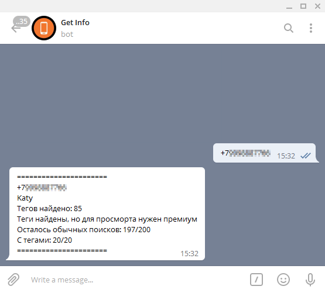

# GetContact Telegram Bot

GetContact API realization as Telegram bot

> Based on https://github.com/Numenorean/GetContactAPI by SERJ.WS. and \_Skill_

## Before run
### Install requirements
```shell script
pip3 install -r requirements.txt
```
### Edit TOKENS
You should edit lines 33-36 and set your personal values
```python
API_TOKEN = '1234567890:AAAABBCCDDEEEFFFGgGHhHJjJKkKLlLMMmf'                 # TG BOT's TOKEN
AES_KEY = '123a1234bb66660000d00ff0f00000f0ff00000f000f000ff9ff9990000fffаf' # FINAL_KEY from GetContactSettingsPref.xml
TOKEN = 'fsffFFFFFlj888s3ffmka234DDdfomIOMNOIJOIfjidjfnu87syfy73hfhkf'       # TOKEn from GetContactSettingsPref.xml
TG_ID = 123456789                                                            # Your telegram id
```

### How to get keys
[Read this [LINK]](https://github.com/kovinevmv/getcontact#how-to-get-keys)

## After run
Just send to your bot some number by format '9998887766' (or '+79998887766')

### Screenshots

